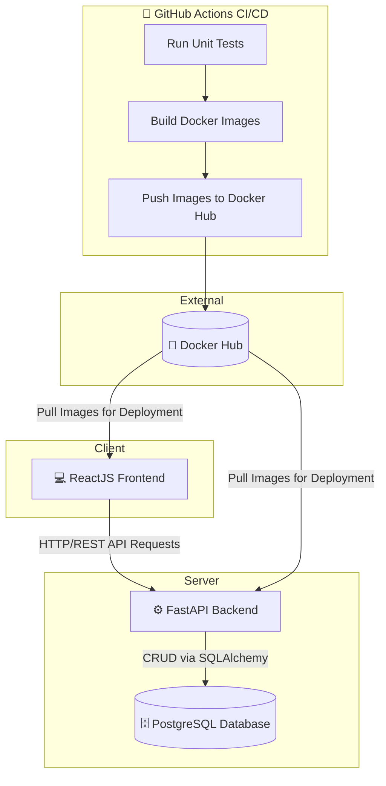

# 📝 TODO List - Mock Project

## 1. Project Overview  
A simple **TODO List application** built to demonstrate a full-stack web project using **FastAPI (backend)**, **ReactJS (frontend)**, and **PostgreSQL** (database).  
The goal of this project is to apply **DevOps practices** — Dockerize the app, automate testing and deployment via **GitHub Actions**, and publish images to **Docker Hub**.  

---

## 2. Features  
- ✅ User can **create, read, update, and delete** TODO items  
- ✅ RESTful API built with **FastAPI**  
- ✅ Frontend with **ReactJS + Axios** for API calls  
- ✅ Database using **PostgreSQL** (or MySQL alternative)  
- ✅ **Swagger UI** and **Postman collection** for API testing  
- ✅ **Docker & Docker Compose** support for full stack deployment  
- ✅ **GitHub Actions CI/CD**:  
  - Run unit tests  
  - Build Docker images  
  - Push to Docker Hub automatically  
- ✅ Optional **AI integration (ChatGPT)** for smart task suggestions  

---

## 3. Tech Stack  

| Layer | Technology |
|-------|-------------|
| **Frontend** | ReactJS, HTML, CSS |
| **Backend** | FastAPI, Python 3.11 |
| **Database** | PostgreSQL  |
| **Containerization** | Docker, Docker Compose |
| **CI/CD** | GitHub Actions |
| **API Docs** | Swagger UI (default from FastAPI) |

---


## 4. System Architecture Diagram ✅

The diagram below illustrates the overall architecture of the TODO List application, showing how the **ReactJS frontend**, **FastAPI backend**, **PostgreSQL database**, and **CI/CD pipeline (GitHub Actions + Docker Hub)** interact.



## 5. Project Structure
```
Mock_project/
├── To_do_backend/
│   ├── src/
│   │   ├── main.py
│   │   ├── models.py
│   │   ├── config.py
│   │   ├── database.py
│   │   └── todos/
│   │       ├── dependencies.py
│   │       ├── exceptions.py
│   │       ├── router.py
│   │       ├── schemas.py
│   │         service.py
│   │
│   ├── tests/
│   │   └── test_todos.py
│   ├── requirements/
│   └── Dockerfile
│
├── frontend/
│   ├── src/
│   │   ├── components/TodoApp.js
│   │   ├── App.js
│   │   ├── index.js
│   │   └── api.js
│   │
│   ├── package*.json
│   └── Dockerfile
│
├── docker-compose.yml
├── .github/ (not yet)
│   └── workflows/
│       └── ci.yml
└── README.md.
```
## 6. Setup & Installation

🐳 Run with Docker Compose

# 1. Clone repo
```
git clone https://github.com/huongtraa/Mock-project.git
cd Mock-project
```
# 2. Run app
```
docker-compose up --build
```

The app will be available at:

Frontend: http://localhost:3000

Backend (Swagger UI): http://localhost:8000/docs


# 4. Run unit tests 
```
docker exec -it to_do_backend-api-1 pytest
```
## 7 API Endpoints

| Method | Endpoint | Description |
|--------|-----------|-------------|
| **GET** | `/api/v1/todos` | Get all todos |
| **GET** | `/api/v1/todos/{id}` | Get single todo |
| **POST** | `/api/v1/todos` | Create new todo |
| **PUT** | `/api/v1/todos/{id}` | Update todo |
| **DELETE** | `/api/v1/todos/{id}` | Delete todo |
| **GET** | `/api/v1/todos/filter/completed` | Get completed todos |
| **GET** | `/api/v1/todos/filter/pending` | Get pending todos |

## 8.📦 Docker Hub


